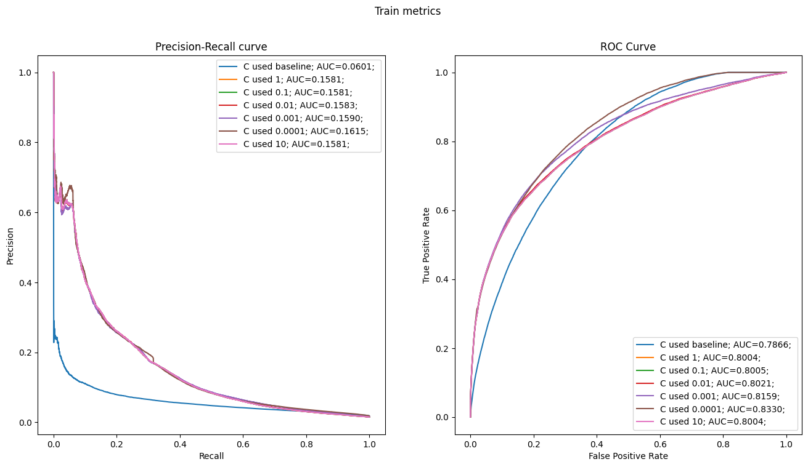
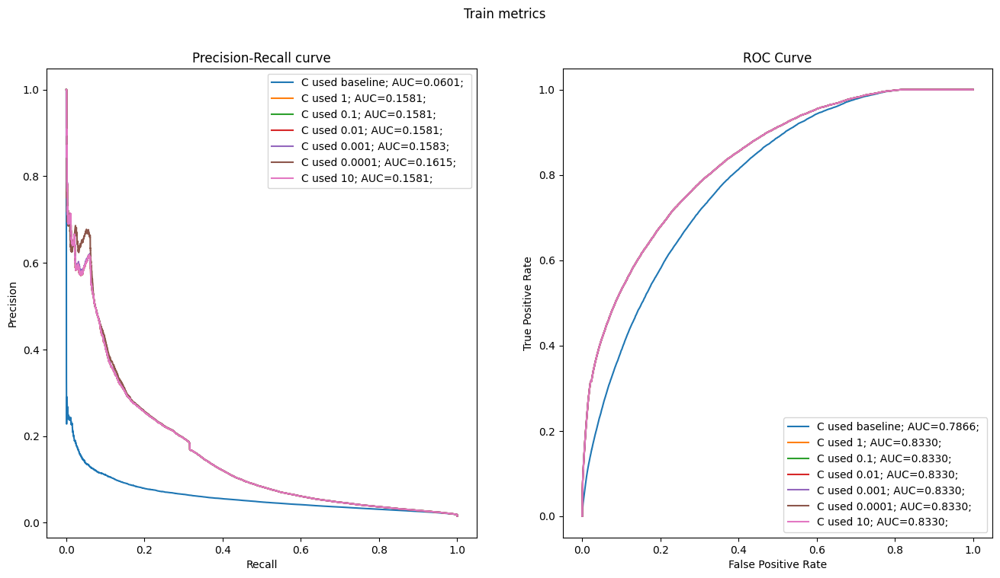

```python
import pandas as pd
import numpy as np
import matplotlib.pyplot as plt
import seaborn as sns
import matplotlib

from sklearn.linear_model import LogisticRegression
from sklearn.metrics import precision_recall_curve, roc_curve, roc_auc_score, auc, PrecisionRecallDisplay
from sklearn.pipeline import make_pipeline, Pipeline
from sklearn.preprocessing import StandardScaler, OneHotEncoder
from sklearn.compose import ColumnTransformer
```


```python
filename_path = "C:/Users/tonbo/Documents/ZriveDS/zrive-ds/src/"
df = pd.read_csv(f"{filename_path}feature_frame.csv")
```


```python
df.head()
```


<div>
<style scoped>
    .dataframe tbody tr th:only-of-type {
        vertical-align: middle;
    }

    .dataframe tbody tr th {
        vertical-align: top;
    }

    .dataframe thead th {
        text-align: right;
    }
</style>
<table border="1" class="dataframe">
  <thead>
    <tr style="text-align: right;">
      <th></th>
      <th>variant_id</th>
      <th>product_type</th>
      <th>order_id</th>
      <th>user_id</th>
      <th>created_at</th>
      <th>order_date</th>
      <th>user_order_seq</th>
      <th>outcome</th>
      <th>ordered_before</th>
      <th>abandoned_before</th>
      <th>...</th>
      <th>count_children</th>
      <th>count_babies</th>
      <th>count_pets</th>
      <th>people_ex_baby</th>
      <th>days_since_purchase_variant_id</th>
      <th>avg_days_to_buy_variant_id</th>
      <th>std_days_to_buy_variant_id</th>
      <th>days_since_purchase_product_type</th>
      <th>avg_days_to_buy_product_type</th>
      <th>std_days_to_buy_product_type</th>
    </tr>
  </thead>
  <tbody>
    <tr>
      <th>0</th>
      <td>33826472919172</td>
      <td>ricepastapulses</td>
      <td>2807985930372</td>
      <td>3482464092292</td>
      <td>2020-10-05 16:46:19</td>
      <td>2020-10-05 00:00:00</td>
      <td>3</td>
      <td>0.0</td>
      <td>0.0</td>
      <td>0.0</td>
      <td>...</td>
      <td>0.0</td>
      <td>0.0</td>
      <td>0.0</td>
      <td>2.0</td>
      <td>33.0</td>
      <td>42.0</td>
      <td>31.134053</td>
      <td>30.0</td>
      <td>30.0</td>
      <td>24.27618</td>
    </tr>
    <tr>
      <th>1</th>
      <td>33826472919172</td>
      <td>ricepastapulses</td>
      <td>2808027644036</td>
      <td>3466586718340</td>
      <td>2020-10-05 17:59:51</td>
      <td>2020-10-05 00:00:00</td>
      <td>2</td>
      <td>0.0</td>
      <td>0.0</td>
      <td>0.0</td>
      <td>...</td>
      <td>0.0</td>
      <td>0.0</td>
      <td>0.0</td>
      <td>2.0</td>
      <td>33.0</td>
      <td>42.0</td>
      <td>31.134053</td>
      <td>30.0</td>
      <td>30.0</td>
      <td>24.27618</td>
    </tr>
    <tr>
      <th>2</th>
      <td>33826472919172</td>
      <td>ricepastapulses</td>
      <td>2808099078276</td>
      <td>3481384026244</td>
      <td>2020-10-05 20:08:53</td>
      <td>2020-10-05 00:00:00</td>
      <td>4</td>
      <td>0.0</td>
      <td>0.0</td>
      <td>0.0</td>
      <td>...</td>
      <td>0.0</td>
      <td>0.0</td>
      <td>0.0</td>
      <td>2.0</td>
      <td>33.0</td>
      <td>42.0</td>
      <td>31.134053</td>
      <td>30.0</td>
      <td>30.0</td>
      <td>24.27618</td>
    </tr>
    <tr>
      <th>3</th>
      <td>33826472919172</td>
      <td>ricepastapulses</td>
      <td>2808393957508</td>
      <td>3291363377284</td>
      <td>2020-10-06 08:57:59</td>
      <td>2020-10-06 00:00:00</td>
      <td>2</td>
      <td>0.0</td>
      <td>0.0</td>
      <td>0.0</td>
      <td>...</td>
      <td>0.0</td>
      <td>0.0</td>
      <td>0.0</td>
      <td>2.0</td>
      <td>33.0</td>
      <td>42.0</td>
      <td>31.134053</td>
      <td>30.0</td>
      <td>30.0</td>
      <td>24.27618</td>
    </tr>
    <tr>
      <th>4</th>
      <td>33826472919172</td>
      <td>ricepastapulses</td>
      <td>2808429314180</td>
      <td>3537167515780</td>
      <td>2020-10-06 10:37:05</td>
      <td>2020-10-06 00:00:00</td>
      <td>3</td>
      <td>0.0</td>
      <td>0.0</td>
      <td>0.0</td>
      <td>...</td>
      <td>0.0</td>
      <td>0.0</td>
      <td>0.0</td>
      <td>2.0</td>
      <td>33.0</td>
      <td>42.0</td>
      <td>31.134053</td>
      <td>30.0</td>
      <td>30.0</td>
      <td>24.27618</td>
    </tr>
  </tbody>
</table>
<p>5 rows × 27 columns</p>
</div>


```python
df.info()
```

    <class 'pandas.core.frame.DataFrame'>
    RangeIndex: 2880549 entries, 0 to 2880548
    Data columns (total 27 columns):
     #   Column                            Dtype  
    ---  ------                            -----  
     0   variant_id                        int64  
     1   product_type                      object 
     2   order_id                          int64  
     3   user_id                           int64  
     4   created_at                        object 
     5   order_date                        object 
     6   user_order_seq                    int64  
     7   outcome                           float64
     8   ordered_before                    float64
     9   abandoned_before                  float64
     10  active_snoozed                    float64
     11  set_as_regular                    float64
     12  normalised_price                  float64
     13  discount_pct                      float64
     14  vendor                            object 
     15  global_popularity                 float64
     16  count_adults                      float64
     17  count_children                    float64
     18  count_babies                      float64
     19  count_pets                        float64
     20  people_ex_baby                    float64
     21  days_since_purchase_variant_id    float64
     22  avg_days_to_buy_variant_id        float64
     23  std_days_to_buy_variant_id        float64
     24  days_since_purchase_product_type  float64
     25  avg_days_to_buy_product_type      float64
     26  std_days_to_buy_product_type      float64
    dtypes: float64(19), int64(4), object(4)
    memory usage: 593.4+ MB
    


```python
df.columns
```


    Index(['variant_id', 'product_type', 'order_id', 'user_id', 'created_at',
           'order_date', 'user_order_seq', 'outcome', 'ordered_before',
           'abandoned_before', 'active_snoozed', 'set_as_regular',
           'normalised_price', 'discount_pct', 'vendor', 'global_popularity',
           'count_adults', 'count_children', 'count_babies', 'count_pets',
           'people_ex_baby', 'days_since_purchase_variant_id',
           'avg_days_to_buy_variant_id', 'std_days_to_buy_variant_id',
           'days_since_purchase_product_type', 'avg_days_to_buy_product_type',
           'std_days_to_buy_product_type'],
          dtype='object')


```python
label_col = ["outcome"]
info_cols = ["variant_id", "order_id", "user_id", "created_at", "order_date"]
feature_cols = [i for i in df.columns if i not in info_cols + label_col]

categorical_cols = ["product_type", "vendor"]
binary_cols = ["ordered_before", "abandoned_before", "active_snoozed", "set_as_regular"]
numerical_cols = [i for i in feature_cols if i not in categorical_cols + binary_cols]
```


```python
# Select only purchases with 5 or more items
def select_relevant_dfs(df: pd.DataFrame):
    order_size = df.groupby("order_id").outcome.sum()
    order_size_greater_index = order_size[order_size >= 5].index
    
    return df.loc[lambda x: x.order_id.isin(order_size_greater_index)]

```


```python
final_df = select_relevant_dfs(df)
```


```python
print(df.shape, final_df.shape)
```

    (2880549, 27) (2163953, 27)
    


```python
# Modify created at and order_date
final_df["created_at"] = pd.to_datetime(final_df["created_at"])
final_df["order_date"] = pd.to_datetime(final_df["order_date"]).dt.date
```

    C:\Users\tonbo\AppData\Local\Temp\ipykernel_23064\3548399307.py:2: SettingWithCopyWarning: 
    A value is trying to be set on a copy of a slice from a DataFrame.
    Try using .loc[row_indexer,col_indexer] = value instead
    
    See the caveats in the documentation: https://pandas.pydata.org/pandas-docs/stable/user_guide/indexing.html#returning-a-view-versus-a-copy
      final_df["created_at"] = pd.to_datetime(final_df["created_at"])
    C:\Users\tonbo\AppData\Local\Temp\ipykernel_23064\3548399307.py:3: SettingWithCopyWarning: 
    A value is trying to be set on a copy of a slice from a DataFrame.
    Try using .loc[row_indexer,col_indexer] = value instead
    
    See the caveats in the documentation: https://pandas.pydata.org/pandas-docs/stable/user_guide/indexing.html#returning-a-view-versus-a-copy
      final_df["order_date"] = pd.to_datetime(final_df["order_date"]).dt.date
    


```python
orders_per_day = final_df.groupby("order_date").order_id.nunique()
```


```python
plt.plot(orders_per_day, label="Orders per day")
plt.title("Orders per day")
```


    Text(0.5, 1.0, 'Orders per day')


    

    


```python
# We want to split the dataframe in 3, however we dont want to split the same orders, we need to group by orders_id and later do the split and we want to do a temporal split

cumsum_orders = orders_per_day.cumsum() / orders_per_day.sum()

max_index_train = cumsum_orders[cumsum_orders <= 0.7].idxmax()
max_index_val = cumsum_orders[cumsum_orders <= 0.8].idxmax()
max_index_test = cumsum_orders.idxmax()
```


```python
train_df = final_df.loc[(final_df["order_date"] >= cumsum_orders.idxmin()) & (final_df["order_date"] <= max_index_train)]
val_df = final_df.loc[(final_df["order_date"] > max_index_train) & (final_df["order_date"] <= max_index_val)]
test_df = final_df.loc[(final_df["order_date"] > max_index_val) & (final_df["order_date"] <= max_index_test)]
```


```python
train_categorical_df = train_df[numerical_cols + binary_cols + categorical_cols + label_col]
val_categorical_df = val_df[numerical_cols + binary_cols + categorical_cols + label_col]
test_categorical_df = test_df[numerical_cols + binary_cols + categorical_cols + label_col]
```


```python
train_df = train_df[numerical_cols + binary_cols + label_col]
val_df = val_df[numerical_cols + binary_cols + label_col]
test_df = test_df[numerical_cols + binary_cols + label_col]
```


```python
train_X = train_df.drop(columns=label_col)
train_y = train_df[label_col]
val_X = val_df.drop(columns=label_col)
val_y = val_df[label_col]
```


```python
# Lets create and train the models, we will create the models for l1 and l2 with different parametes
pipe = make_pipeline(StandardScaler(), LogisticRegression(penalty='l1', C=1, solver="saga"))
pipe.fit(train_X, train_y.values.ravel())
```


<style>#sk-container-id-1 {color: black;background-color: white;}#sk-container-id-1 pre{padding: 0;}#sk-container-id-1 div.sk-toggleable {background-color: white;}#sk-container-id-1 label.sk-toggleable__label {cursor: pointer;display: block;width: 100%;margin-bottom: 0;padding: 0.3em;box-sizing: border-box;text-align: center;}#sk-container-id-1 label.sk-toggleable__label-arrow:before {content: "▸";float: left;margin-right: 0.25em;color: #696969;}#sk-container-id-1 label.sk-toggleable__label-arrow:hover:before {color: black;}#sk-container-id-1 div.sk-estimator:hover label.sk-toggleable__label-arrow:before {color: black;}#sk-container-id-1 div.sk-toggleable__content {max-height: 0;max-width: 0;overflow: hidden;text-align: left;background-color: #f0f8ff;}#sk-container-id-1 div.sk-toggleable__content pre {margin: 0.2em;color: black;border-radius: 0.25em;background-color: #f0f8ff;}#sk-container-id-1 input.sk-toggleable__control:checked~div.sk-toggleable__content {max-height: 200px;max-width: 100%;overflow: auto;}#sk-container-id-1 input.sk-toggleable__control:checked~label.sk-toggleable__label-arrow:before {content: "▾";}#sk-container-id-1 div.sk-estimator input.sk-toggleable__control:checked~label.sk-toggleable__label {background-color: #d4ebff;}#sk-container-id-1 div.sk-label input.sk-toggleable__control:checked~label.sk-toggleable__label {background-color: #d4ebff;}#sk-container-id-1 input.sk-hidden--visually {border: 0;clip: rect(1px 1px 1px 1px);clip: rect(1px, 1px, 1px, 1px);height: 1px;margin: -1px;overflow: hidden;padding: 0;position: absolute;width: 1px;}#sk-container-id-1 div.sk-estimator {font-family: monospace;background-color: #f0f8ff;border: 1px dotted black;border-radius: 0.25em;box-sizing: border-box;margin-bottom: 0.5em;}#sk-container-id-1 div.sk-estimator:hover {background-color: #d4ebff;}#sk-container-id-1 div.sk-parallel-item::after {content: "";width: 100%;border-bottom: 1px solid gray;flex-grow: 1;}#sk-container-id-1 div.sk-label:hover label.sk-toggleable__label {background-color: #d4ebff;}#sk-container-id-1 div.sk-serial::before {content: "";position: absolute;border-left: 1px solid gray;box-sizing: border-box;top: 0;bottom: 0;left: 50%;z-index: 0;}#sk-container-id-1 div.sk-serial {display: flex;flex-direction: column;align-items: center;background-color: white;padding-right: 0.2em;padding-left: 0.2em;position: relative;}#sk-container-id-1 div.sk-item {position: relative;z-index: 1;}#sk-container-id-1 div.sk-parallel {display: flex;align-items: stretch;justify-content: center;background-color: white;position: relative;}#sk-container-id-1 div.sk-item::before, #sk-container-id-1 div.sk-parallel-item::before {content: "";position: absolute;border-left: 1px solid gray;box-sizing: border-box;top: 0;bottom: 0;left: 50%;z-index: -1;}#sk-container-id-1 div.sk-parallel-item {display: flex;flex-direction: column;z-index: 1;position: relative;background-color: white;}#sk-container-id-1 div.sk-parallel-item:first-child::after {align-self: flex-end;width: 50%;}#sk-container-id-1 div.sk-parallel-item:last-child::after {align-self: flex-start;width: 50%;}#sk-container-id-1 div.sk-parallel-item:only-child::after {width: 0;}#sk-container-id-1 div.sk-dashed-wrapped {border: 1px dashed gray;margin: 0 0.4em 0.5em 0.4em;box-sizing: border-box;padding-bottom: 0.4em;background-color: white;}#sk-container-id-1 div.sk-label label {font-family: monospace;font-weight: bold;display: inline-block;line-height: 1.2em;}#sk-container-id-1 div.sk-label-container {text-align: center;}#sk-container-id-1 div.sk-container {/* jupyter's `normalize.less` sets `[hidden] { display: none; }` but bootstrap.min.css set `[hidden] { display: none !important; }` so we also need the `!important` here to be able to override the default hidden behavior on the sphinx rendered scikit-learn.org. See: https://github.com/scikit-learn/scikit-learn/issues/21755 */display: inline-block !important;position: relative;}#sk-container-id-1 div.sk-text-repr-fallback {display: none;}</style><div id="sk-container-id-1" class="sk-top-container"><div class="sk-text-repr-fallback"><pre>Pipeline(steps=[(&#x27;standardscaler&#x27;, StandardScaler()),
                (&#x27;logisticregression&#x27;,
                 LogisticRegression(C=1, penalty=&#x27;l1&#x27;, solver=&#x27;saga&#x27;))])</pre><b>In a Jupyter environment, please rerun this cell to show the HTML representation or trust the notebook. <br />On GitHub, the HTML representation is unable to render, please try loading this page with nbviewer.org.</b></div><div class="sk-container" hidden><div class="sk-item sk-dashed-wrapped"><div class="sk-label-container"><div class="sk-label sk-toggleable"><input class="sk-toggleable__control sk-hidden--visually" id="sk-estimator-id-1" type="checkbox" ><label for="sk-estimator-id-1" class="sk-toggleable__label sk-toggleable__label-arrow">Pipeline</label><div class="sk-toggleable__content"><pre>Pipeline(steps=[(&#x27;standardscaler&#x27;, StandardScaler()),
                (&#x27;logisticregression&#x27;,
                 LogisticRegression(C=1, penalty=&#x27;l1&#x27;, solver=&#x27;saga&#x27;))])</pre></div></div></div><div class="sk-serial"><div class="sk-item"><div class="sk-estimator sk-toggleable"><input class="sk-toggleable__control sk-hidden--visually" id="sk-estimator-id-2" type="checkbox" ><label for="sk-estimator-id-2" class="sk-toggleable__label sk-toggleable__label-arrow">StandardScaler</label><div class="sk-toggleable__content"><pre>StandardScaler()</pre></div></div></div><div class="sk-item"><div class="sk-estimator sk-toggleable"><input class="sk-toggleable__control sk-hidden--visually" id="sk-estimator-id-3" type="checkbox" ><label for="sk-estimator-id-3" class="sk-toggleable__label sk-toggleable__label-arrow">LogisticRegression</label><div class="sk-toggleable__content"><pre>LogisticRegression(C=1, penalty=&#x27;l1&#x27;, solver=&#x27;saga&#x27;)</pre></div></div></div></div></div></div></div>


```python
y_pred = pipe.predict(val_X)
y_pred = pipe.predict_proba(val_X)[:, 1]
```


```python
y_pred
```


    array([0.00915498, 0.01739591, 0.00935809, ..., 0.00344241, 0.00284812,
           0.00344241])


```python
precision, recall, _ = precision_recall_curve(val_y, y_pred)
```


```python
pr_display = PrecisionRecallDisplay(precision=precision, recall=recall)
pr_display.plot()
```


    <sklearn.metrics._plot.precision_recall_curve.PrecisionRecallDisplay at 0x2a86244d6f0>


    

    


We've checked that our models execute, now let's write a baseline and after that test which parameters fit best to out case


```python
# Baseline will be popularity
precision, recall, _ = precision_recall_curve(val_y, val_X["global_popularity"])
pr_display = PrecisionRecallDisplay(precision=precision, recall=recall)
pr_display.plot()
```


    <sklearn.metrics._plot.precision_recall_curve.PrecisionRecallDisplay at 0x2a8623736a0>


    

    


```python
def plot_metrics(c:str, y_true: pd.Series, y_pred: pd.Series, figure:tuple[matplotlib.figure.Figure, np.array] = None, lgd_msg: str = ""):
    precision, recall, _ = precision_recall_curve(y_true, y_pred)
    auc_score = auc(recall, precision)

    fpr, tpr, _ = roc_curve(y_true, y_pred)
    roc_auc = roc_auc_score(y_true, y_pred)

    if not figure:
        fig, ax = plt.subplots(1, 2, figsize=(16, 8))
    else:
        fig, ax = figure

    ax[0].plot(recall, precision, label=f"C used {c}; AUC={auc_score:.4f}; {lgd_msg}")
    ax[0].set_xlabel("Recall")
    ax[0].set_ylabel("Precision")
    ax[0].set_title("Precision-Recall curve")
    ax[0].legend()

    ax[1].plot(fpr, tpr, label=f"C used {c}; AUC={roc_auc:.4f}; {lgd_msg}")
    ax[1].set_xlabel("False Positive Rate")
    ax[1].set_ylabel("True Positive Rate")
    ax[1].set_title("ROC Curve")
    ax[1].legend()


```

Ridge


```python
cs = ["baseline", 1, 0.1, 1e-2, 1e-3, 1e-4, 10]
fig1, axs1 = plt.subplots(1, 2, figsize=(16, 8))
fig1.suptitle("Train metrics")
fig2, axs2 = plt.subplots(1, 2, figsize=(16, 8))
fig2.suptitle("Validation metrics")


for index, c in enumerate(cs):
    if c == "baseline":
        print("Creating baseline model")
        train_y_pred = train_X["global_popularity"]
        val_y_pred = val_X["global_popularity"]
    else:
        print(f"Creating model for C = {c}, index {index}")
        pipe = make_pipeline(StandardScaler(), LogisticRegression(penalty='l2', C=c, solver="saga"))
        pipe.fit(train_X, train_y.values.ravel())
        train_y_pred = pipe.predict_proba(train_X)[:, 1]
        val_y_pred = pipe.predict_proba(val_X)[:, 1]
    plot_metrics(c, train_y, train_y_pred, (fig1, axs1))
    plot_metrics(c, val_y, val_y_pred, (fig2, axs2))
```

    Creating baseline model
    Creating model for C = 1, index 1
    Creating model for C = 0.1, index 2
    Creating model for C = 0.01, index 3
    Creating model for C = 0.001, index 4
    Creating model for C = 0.0001, index 5
    Creating model for C = 10, index 6
    


    

    


    

    


Lasso


```python
cs = ["baseline", 1, 0.1, 1e-2, 1e-3, 1e-4, 10]
fig1, axs1 = plt.subplots(1, 2, figsize=(16, 8))
fig1.suptitle("Train metrics")
fig2, axs2 = plt.subplots(1, 2, figsize=(16, 8))
fig2.suptitle("Validation metrics")


for index, c in enumerate(cs):
    if c == "baseline":
        print("Creating baseline model")
        train_y_pred = train_X["global_popularity"]
        val_y_pred = val_X["global_popularity"]
    else:
        print(f"Creating model for C = {c}, index {index}")
        pipe = make_pipeline(StandardScaler(), LogisticRegression(penalty='l1', C=c, solver="saga"))
        pipe.fit(train_X, train_y.values.ravel())
        train_y_pred = pipe.predict_proba(train_X)[:, 1]
        val_y_pred = pipe.predict_proba(val_X)[:, 1]
    plot_metrics(c, train_y, train_y_pred, (fig1, axs1))
    plot_metrics(c, val_y, val_y_pred, (fig2, axs2))
```

    Creating baseline model
    Creating model for C = 1, index 1
    Creating model for C = 0.1, index 2
    Creating model for C = 0.01, index 3
    Creating model for C = 0.001, index 4
    Creating model for C = 0.0001, index 5
    Creating model for C = 10, index 6
    


    

    


    

    


See what features are given more "importance"


```python
c = 1e-4
pipe = Pipeline([("standard_scaler", StandardScaler()), ("lr", LogisticRegression(penalty="l1", C=c, solver="saga"))])
pipe.fit(train_X, train_y)
pipe_coeffs_l1 = pd.DataFrame({"features": numerical_cols + binary_cols, "importance": np.abs(pipe.named_steps["lr"].coef_[0]), "regularisation": ["l1"]*len(numerical_cols + binary_cols)})
pipe_coeffs_l1.sort_values("importance", ascending=True)

pipe = Pipeline([("standard_scaler", StandardScaler()), ("lr", LogisticRegression(penalty="l2", C=c, solver="saga"))])
pipe.fit(train_X, train_y)
pipe_coeffs_l2 = pd.DataFrame({"features": numerical_cols + binary_cols, "importance": np.abs(pipe.named_steps["lr"].coef_[0]), "regularisation": ["l2"]*len(numerical_cols + binary_cols)})
pipe_coeffs_l2.sort_values("importance", ascending=True)

pipe_coeffs = pd.concat([pipe_coeffs_l1, pipe_coeffs_l2])
pipe_coeffs["features"] = pd.Categorical(pipe_coeffs["features"])
pipe_coeffs = pipe_coeffs.sort_values("importance")
order_columns = pipe_coeffs_l2.sort_values("importance", ascending=False)["features"]
sns.barplot(pipe_coeffs, x="importance", y="features", hue="regularisation", order=order_columns)
```

    c:\Apps\lib\site-packages\sklearn\utils\validation.py:1111: DataConversionWarning: A column-vector y was passed when a 1d array was expected. Please change the shape of y to (n_samples, ), for example using ravel().
      y = column_or_1d(y, warn=True)
    c:\Apps\lib\site-packages\sklearn\utils\validation.py:1111: DataConversionWarning: A column-vector y was passed when a 1d array was expected. Please change the shape of y to (n_samples, ), for example using ravel().
      y = column_or_1d(y, warn=True)
    


    <AxesSubplot:xlabel='importance', ylabel='features'>


    

    


```python
importance_cols = ["ordered_before", "global_popularity", "abandoned_before"]
```


```python
cs = ["baseline", 1, 0.1, 1e-2, 1e-3, 1e-4, 10]
fig1, axs1 = plt.subplots(1, 2, figsize=(16, 8))
fig1.suptitle("Train metrics")
fig2, axs2 = plt.subplots(1, 2, figsize=(16, 8))
fig2.suptitle("Validation metrics")


for index, c in enumerate(cs):
    if c == "baseline":
        print("Creating baseline model")
        train_y_pred = train_X["global_popularity"]
        val_y_pred = val_X["global_popularity"]
    else:
        print(f"Creating model for C = {c}, index {index}")
        pipe = make_pipeline(StandardScaler(), LogisticRegression(penalty='l1', C=c, solver="saga"))
        pipe.fit(train_X[importance_cols], train_y.values.ravel())
        train_y_pred = pipe.predict_proba(train_X[importance_cols])[:, 1]
        val_y_pred = pipe.predict_proba(val_X[importance_cols])[:, 1]
    plot_metrics(c, train_y, train_y_pred, (fig1, axs1))
    plot_metrics(c, val_y, val_y_pred, (fig2, axs2))
```

    Creating baseline model
    Creating model for C = 1, index 1
    Creating model for C = 0.1, index 2
    Creating model for C = 0.01, index 3
    Creating model for C = 0.001, index 4
    Creating model for C = 0.0001, index 5
    Creating model for C = 10, index 6
    


    

    


    

    


```python
cs = ["baseline", 1, 0.1, 1e-2, 1e-3, 1e-4, 10]
fig1, axs1 = plt.subplots(1, 2, figsize=(16, 8))
fig1.suptitle("Train metrics")
fig2, axs2 = plt.subplots(1, 2, figsize=(16, 8))
fig2.suptitle("Validation metrics")


for index, c in enumerate(cs):
    if c == "baseline":
        print("Creating baseline model")
        train_y_pred = train_X["global_popularity"]
        val_y_pred = val_X["global_popularity"]
    else:
        print(f"Creating model for C = {c}, index {index}")
        pipe = make_pipeline(StandardScaler(), LogisticRegression(penalty='l2', C=c, solver="saga"))
        pipe.fit(train_X[importance_cols], train_y.values.ravel())
        train_y_pred = pipe.predict_proba(train_X[importance_cols])[:, 1]
        val_y_pred = pipe.predict_proba(val_X[importance_cols])[:, 1]
    plot_metrics(c, train_y, train_y_pred, (fig1, axs1))
    plot_metrics(c, val_y, val_y_pred, (fig2, axs2))
```

    Creating baseline model
    Creating model for C = 1, index 1
    Creating model for C = 0.1, index 2
    Creating model for C = 0.01, index 3
    Creating model for C = 0.001, index 4
    Creating model for C = 0.0001, index 5
    Creating model for C = 10, index 6
    


    

    


    

    


As we have seen in all the examples our linear model works better than the baseline, this encourage us to continue investigating and get the best of our model 

Let's test with Categorical Variables


```python
train_cat_X = train_categorical_df.drop(columns=label_col)
val_cat_X = val_categorical_df.drop(columns=label_col)
```


```python
train_y = train_y.values.ravel()
val_y = val_y.values.ravel()
```


```python
encoders = [
    ("drop", "drop"),
    ("OneHot", OneHotEncoder(max_categories=20, handle_unknown="ignore"))
]

fig1, axs1 = plt.subplots(1, 2, figsize=(16, 8))
fig1.suptitle("Encoders training")

fig2, axs2 = plt.subplots(1, 2, figsize=(16, 8))
fig2.suptitle("Encoders validation")

for name, enc in encoders:
    preprocessor = ColumnTransformer([("numerical", "passthrough", numerical_cols + binary_cols), ("categorical", enc, categorical_cols)])
    pipe = make_pipeline(
        preprocessor, 
        StandardScaler(), 
        LogisticRegression(penalty="l2", C=1e-4)
    )

    pipe.fit(train_cat_X, train_y)
    train_cat_y_pred = pipe.predict_proba(train_cat_X)[:, 1]
    plot_metrics(c=1e-4, y_true=train_y, y_pred=train_cat_y_pred, figure=(fig1, axs1), lgd_msg=f"Encoder: {name}")

    val_cat_y_pred = pipe.predict_proba(val_cat_X)[:, 1]
    plot_metrics(c=1e-4, y_true=val_y, y_pred=val_cat_y_pred, figure=(fig2, axs2), lgd_msg=f"Encoder: {name}")
```


    

    


    

    


```python
encoders = [
    ("drop", "drop"),
    ("OneHot", OneHotEncoder(max_categories=20, handle_unknown="ignore"))
]

fig1, axs1 = plt.subplots(1, 2, figsize=(16, 8))
fig1.suptitle("Encoders training")

fig2, axs2 = plt.subplots(1, 2, figsize=(16, 8))
fig2.suptitle("Encoders validation")

for name, enc in encoders:
    preprocessor = ColumnTransformer([("numerical", "passthrough", numerical_cols + binary_cols), ("categorical", enc, categorical_cols)])
    pipe = make_pipeline(
        preprocessor, 
        StandardScaler(), 
        LogisticRegression(penalty="l2", C=1e-4)
    )

    pipe.fit(train_cat_X, train_y)
    train_cat_y_pred = pipe.predict_proba(train_cat_X)[:, 1]
    plot_metrics(c=1e-4, y_true=train_y, y_pred=train_cat_y_pred, figure=(fig1, axs1), lgd_msg=f"Encoder: {name}")

    val_cat_y_pred = pipe.predict_proba(val_cat_X)[:, 1]
    plot_metrics(c=1e-4, y_true=val_y, y_pred=val_cat_y_pred, figure=(fig2, axs2), lgd_msg=f"Encoder: {name}")
```


    

    


    

    


```python

```
